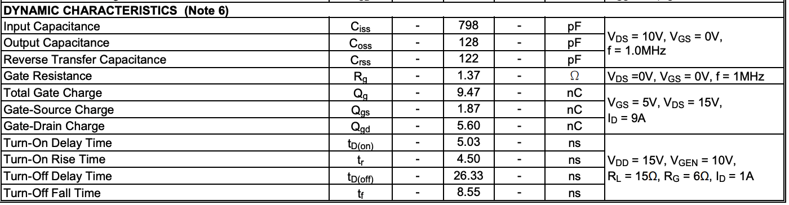

# Calculations and Analysis - Rev B. 

In this section, we examine the order in which we collect our data to obtain the necessary specifications of our system. Let's review the constraints of our drone as a starting point. 

## Previous Calculations: 

The previous rev used components that were made for much larger applications than the original design, so another round of component selection will be made to determine a better solution to solving the problem at hand. 

In the previous rev, the motors were designed for an aircraft over 2x the specified weight. I adjusted the weight specification to be 2.5 kg instead of 1 kg to enhance the design challenge. 

In this pass, we will do more calculations against the specifications so we have a better approach to searching for the appropriate components. I found a calculator to provide some guidance for some starting values. [Drone Motor Spec. Calculator](https://everydrone.io/en/drone-calculators/motor-spec). 

## Drone Specifications

| Specification | Value |
|---|---|
| Thrust to Weight Ratio | 2:1 |
| Weight | 2.5 kg | 
| Number of Motors | 4 |
| Max Altitude | 10,000 ft. |
| Flight Time @ Sea-Level  | 25 min |

## Calculation Results

From this motor calculation, 

## Motor Selection 

Based on the Calculations, here is a suitable motor for this application. $35 instead of $100 per motor. 41g instead of 350g (almost 10-fold improvement!). 

#### [BrotherHobby Avenger 2806.5 Motor - 870KV/1300KV/1460KV/1700KV](https://www.getfpv.com/brotherhobby-avenger-2806-5-motor-870kv-1300kv-1460kv-1700kv.html?vid=8055&gc_id=21805212384&g_special_campaign=true&gad_source=1&gad_campaignid=21805212384&gbraid=0AAAAAD8cN5Kuq-IfOitbzw_GL8UaSo2bc&gclid=CjwKCAjwwL_UBhAjEiwAEhuT5ADEHAjkh7gZ3n-AU1Sf_G2JTFoRa2S-CFk0gGRLpDZt2DXi9EnJoBoCpMIQAvD_BwE)

The motor has to run at 10,000 feet. We will calculate the minimum KV rating using formulas from the following source. [Drone Altitude Performance Formulas](https://news.quadpartpicker.com/how-to-estimate-and-calculate-drone-flight-characteristics/). 

To calculate the motor KV rating we need to support flight @ 10,000 ft while minimizing the current draw. The ideal KV rating will be as high as we can go so we can minimize continuous current at that altitude. 

T: Thrust in Newtons
CT: Thrust coefficient (typically ranges from 0.1 to 0.2 for common hobby props)
ρ: Air density (approx 1.225 kg/m3 at sea level)
n: Rotational speed in revolutions per second (RPS)
D: Propeller diameter in meters

T = CT * ρ * n^2 * D^4

Propeller Selection: 

[HQProp DP 7X3.5X3 PC Propeller (Set of 4 - Smoke Grey)](https://www.getfpv.com/hqprop-dp-7x3-5x3-pc-propeller-set-of-4-smoke-grey.html)

#### Prop Specs
Thrust coefficient not specified. We will need to find from motor thrust table. 

T = 2500 gf total. Thrust per motor: 625 gf. 

TODO: ADJUST CALCULATION BASED ON THE 1700 KV TABLE

Rounding up to 750 gf on table, we can solve for CT using:
- T = 750 gf
- ρ = 1.225 kg/m^3 (sea level)
- n^2 = 40,884 (rps)^2
- D^4 = 1e-3 m^2 

CT = 0.147

At 10,000 ft (ρ = 0.9046 kg/m³), T = 750 gf = 7.355 N, C_T = 0.1468, D⁴ = 1×10⁻³ m⁴:

n² = 7.355 / (0.1468 × 0.9046 × 0.001)
n² = 7.355 / 1.328×10⁻⁴
n² ≈ 55,382 (rps)²

n = √55,382 ≈ 235.3 rps

Convert to RPM:
235.3 × 60 ≈ 14,120 RPM

Looking at the load test data table, looking at the calculated RPM we find the voltage is within range for the 1700KV motor. The current will be lower at altitude so no need to calculate the current at altitude - requirements will be met. 

### Important Motor Specs: 

### Maxiumum I-V Characteristics for Motor

Since the thrust to weight ratio is 2:1, and the weight of the unit is at maximum 2.5 kg, then the maximum thrust is 2500*2/4 = 1250 gf. Based on the table from the motor load test data, the operating point at sea-level will be ~35% throttle. We'll round up to 40% throttle. This gives us an operating point of 24V, 5.7 A. We will define the driver specification to be Vmax = 30V and Imax = 6.5 A. 

### MOSFET Selection: 

Vdsmax > 33V with a 10% margin. Ids max 7.15V. To get an idea of some switches, I will search on digikey mosfets around these specifications. 

[N-Channel 30 V 7.44A (Ta) 940mW (Ta) Surface Mount U-DFN3030-8](https://www.digikey.com/en/products/detail/diodes-incorporated/DMG4800LFG-7/2192623)

This MOSFET has a low RDS_on maximum of 17 mOhms. The switching characteristics of this MOSFET has short turn on and off times (ns range). 

This switch costs $10.98 for a quantity of 25. We'll need 24 per drone. 

