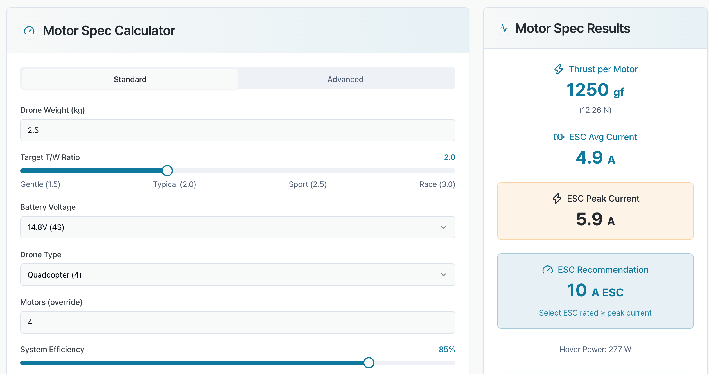
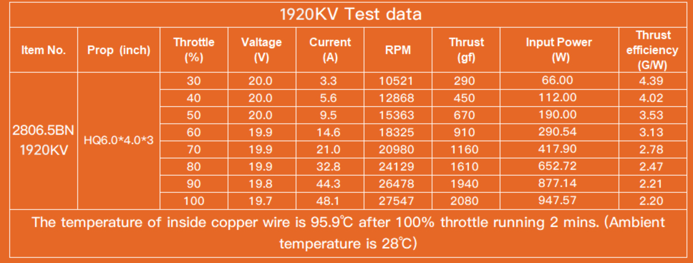
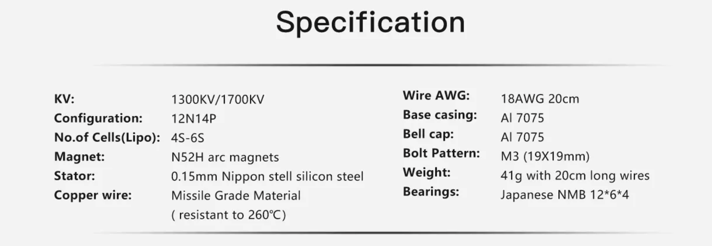

# Calculations and Analysis - Rev B. 

In this section, we examine the order in which we collect our data to obtain the necessary specifications of our system. Let's review the constraints of our drone as a starting point. 

## Previous Calculations: 

The previous rev used components that were made for much larger applications than the original design, so another round of component selection will be made to determine a better solution to solving the problem at hand. 

In the previous rev, the motors were designed for an aircraft over 2x the specified weight. I adjusted the weight specification to be 2.5 kg instead of 1 kg to enhance the design challenge. 

In this pass, we will do more calculations against the specifications so we have a better approach to searching for the appropriate components. I found a calculator to provide some guidance for some starting values. [Drone Motor Spec. Calculator](https://everydrone.io/en/drone-calculators/motor-spec). 

## Drone Specifications

| Specification | Value |
|---|---|
| Thrust to Weight Ratio | 2:1 |
| Weight | 2.5 kg | 
| Number of Motors | 4 |
| Max Altitude | 10,000 ft. |
| Flight Time @ Sea-Level  | 25 min |

## Calculation Results

From this motor calculation, 

## Motor Selection 

Based on the Calculations, here is a suitable motor for this application. $35 instead of $100 per motor. 41g instead of 350g (almost 10-fold improvement!). 

#### [BrotherHobby Avenger 2806.5 Motor](https://brotherhobby.com/avenger-28065-motor-p00132p1.html)

The motor has to run at 10,000 feet. We will calculate the minimum KV rating using formulas from the following source. [Drone Altitude Performance Formulas](https://news.quadpartpicker.com/how-to-estimate-and-calculate-drone-flight-characteristics/). 

To calculate the motor KV rating we need to support flight @ 10,000 ft while minimizing the current draw. The ideal KV rating will be as high as we can go so we can minimize continuous current at that altitude. 

T: Thrust in Newtons
CT: Thrust coefficient (typically ranges from 0.1 to 0.2 for common hobby props)
ρ: Air density (approx 1.225 kg/m3 at sea level)
n: Rotational speed in revolutions per second (RPS)
D: Propeller diameter in meters

T = CT * ρ * n^2 * D^4

Propeller Selection: 

[HQProp DP 7X3.5X3 PC Propeller (Set of 4 - Smoke Grey)](https://www.getfpv.com/hqprop-dp-7x3-5x3-pc-propeller-set-of-4-smoke-grey.html)

#### Prop Specs
Thrust coefficient not specified. We will need to find from motor thrust table. 

T = 5000 gf total. Thrust per motor: 1250 gf. 

Altitude Calculations:

At 10,000 ft (ρ = 0.9046 kg/m³) only the RPM and density change. Scale n^2 (rps)^2 by sqrt of density ratio between altitude and sea-level (1.35). RPS @ 10,000 ft -> n = √(1.35*182,329) = 496 rps -> 29,767 rpm

The motor is just outside 100% throttle range (only by 100). 100% throttle at altitude, the motor isn't fighting the same load it was at sea level — it will spin faster than 29,610 RPM at the same voltage, not get stuck at it, because there's less back-torque holding it down. The target of 29,767 RPM is only ~157 RPM above the sea-level 100%-throttle point, and the reduced air density more than accounts for that gap — likely hit that RPM well under 100% throttle at altitude, with lower current draw than the 49.2 A / 1170 W shown at sea level (since required thrust/torque is lower at that RPM too).

Important consideration is that driving the motor past that RPM risks overloading the motor. The 100% throttle isn't continuous, but since the drone will not be maneuvering up at full load more than 50% of the time, temperature will not be an issue.

### Important Motor Specs: 

### Maxiumum I-V Characteristics for Motor

We will look at the current at 100% motor throttle to determine maximum driver current. Practically, since the thrust will be lower than the specified table, current will be lower than this value. Regardless, let's make the current specification worst-case scenario: 49.2 A. Giving 10% margin we get ~55 A. This will be the driver rating.

### MOSFET Selection: 

Vdsmax = ~27V with a 10% margin. Let's round to 30V for additional wiggle-room. I will search on digikey mosfets around these specifications. 

Vds max > 30V
Ids max > 55A

[TK7R7P10PL](https://www.digikey.com/en/products/detail/toshiba-semiconductor-and-storage/TK7R7P10PL-RQ/10447111)

$45 for qty 50 -> 2 drones

