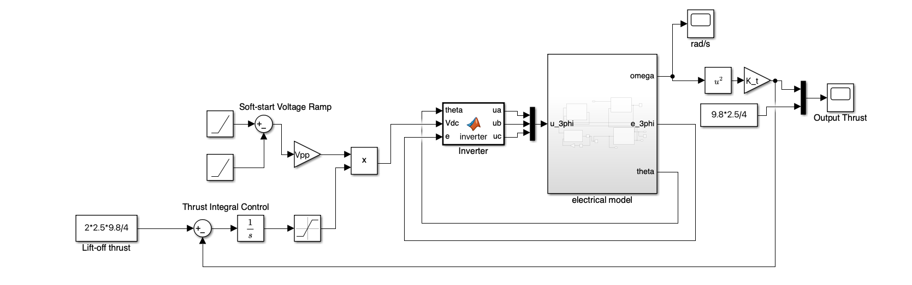
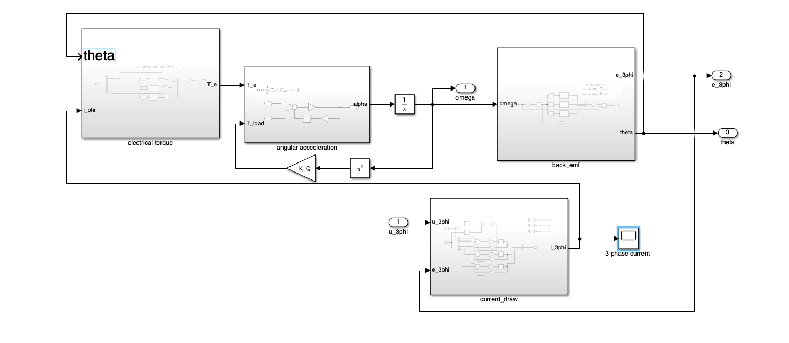
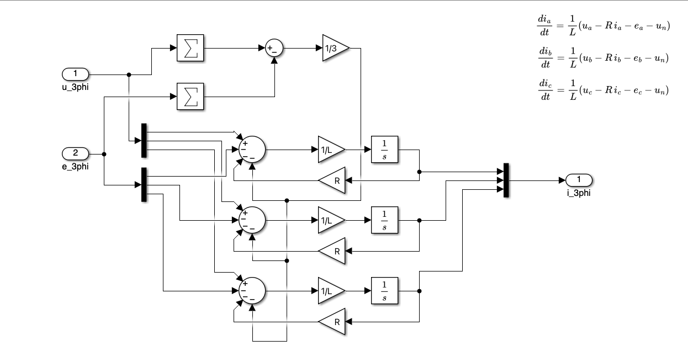
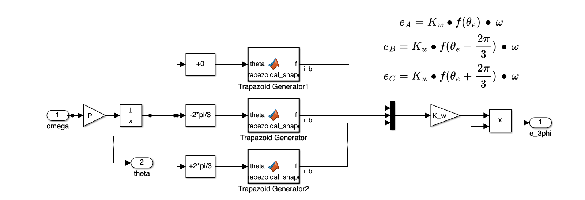
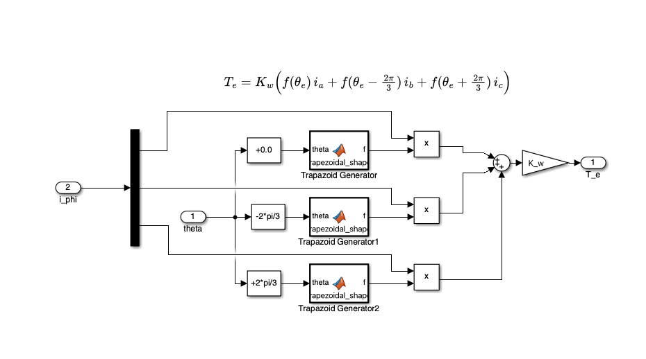
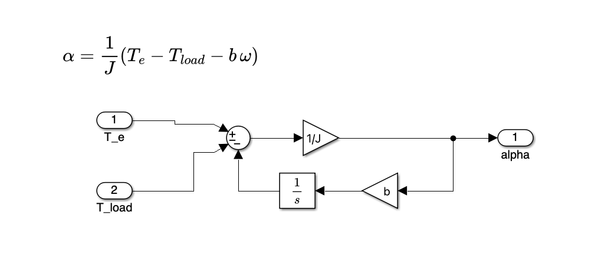

# Model Results

The completed simulink model is shown in this document. Below shows the parameters used for the motor model. 

```matlab
%% BLDC Motor Parameters — from Model_Derivations.md

R = 0.05;
L = 9e-6;
K_w = 0.00562;
P = 7;
b = 1e-6;
J = 3e-6;
K_Q = 2.86e-8;
K_t = 2.5e-6; 
Vpp = 30; 
ramp_up_time = 0.1;
```

## Complete System

The complete system models the behavior of the BLDC motor with realistic parameters given by research and calculations. The model features closed-loop integral control of drone thrust



In this model, a voltage ramp-up soft-start drives the powers the inverter. The input voltage in the inverter will be controlled by a buck converter in practice. Instead of having individual DC-DC converter controllers, we will have one DC-DC converter powering the uC and the rest of the converters will be controlled by the MCU itself. 

The ouptut thrust is controlled using basic integral control. Scaling the integral feedback unnecessary as the desired response was output for a step-input of maximum thrust (calculated per-specification). 

## Electrical System

The electrical system models the motors input voltage and output current chracteristics in addition to it's mechanical output (angular velocity). In this subsystem, the propeller load was simulated using the square-torque relation to angular velocity. 



### Current Subsystem

The current is calculated from the electrical model containing parameters such as winding resistance and inductance. It considers the back-emf produced from the "neutral" reference point from the wye configuration of the electrical model. Note the load is unbalanced, so this additional neutral voltage is needed to produce accurate results. 



### Reverse EMF Subsystem

The reverse EMF can be approximated by a trapazoidal voltage proportional to the angular velocity of the shaft. The back-emf is scaled by a constant of proportionality calculated in other sections of this project. 



### Torque Generation Subsystem

Since torque produced depends on the magnetic field inside of the stator, it is related to the back-emf, however it is not scaled by the angular velocity since permanent magnets reside inside the rotor. The current is what produces the other magnetic field that results in a net torque on the rotor. This calculation is performed in this subsystem. 



### Net Torque to Angular Acceleration Subsystem

This is simply a basic calculation of angular acceleration using the net torque calculation. The inputs to this section are the electrical torque along with the load torque. This is what determines the angular acceleration. 



## Motor Performance And Results. 

