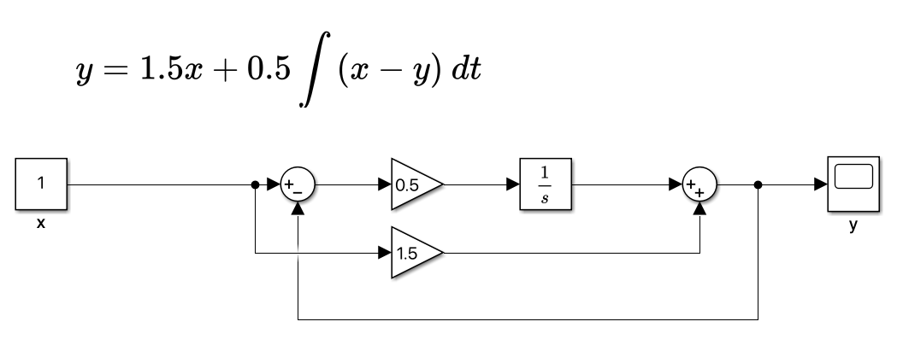
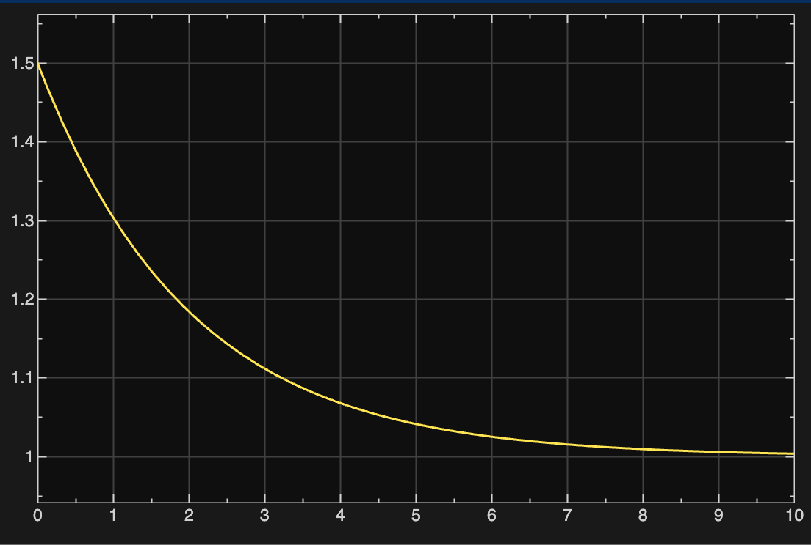
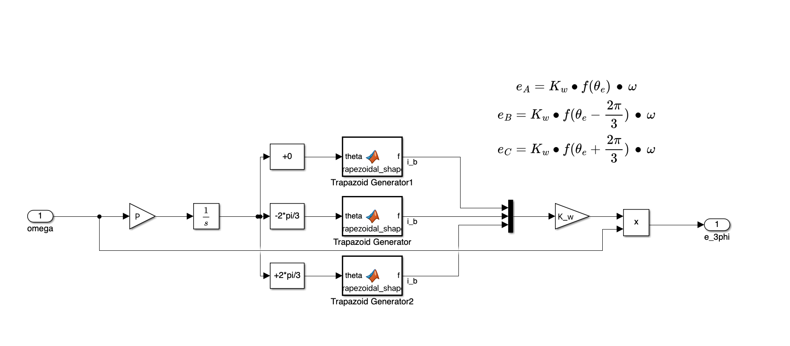
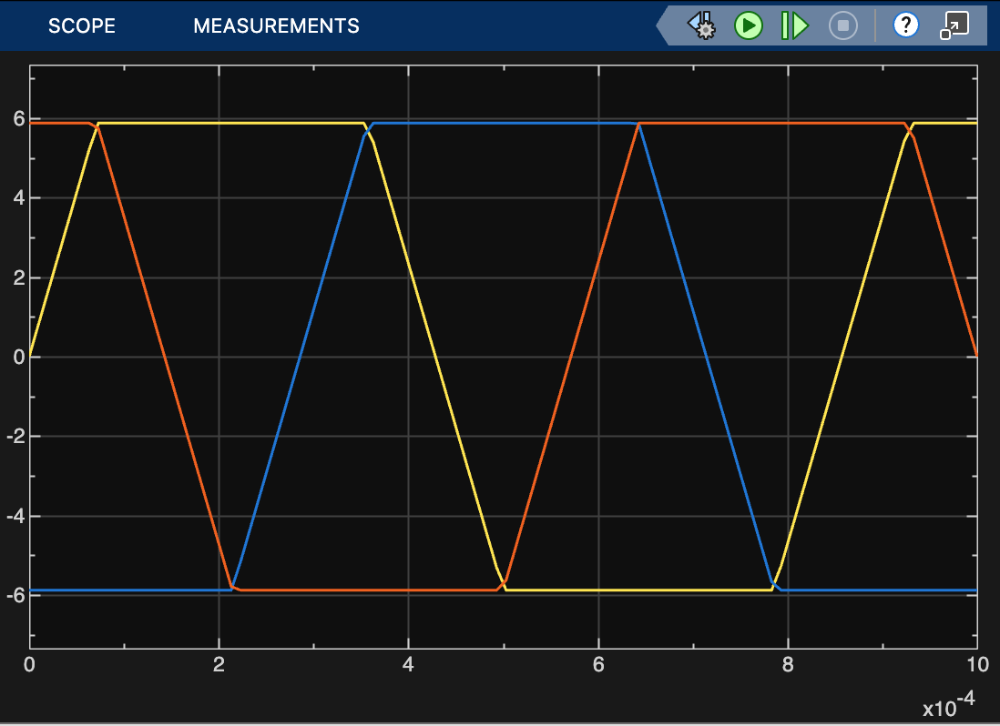

# Simulink Model Development

Simulink is essentially a fancy differential equation solver. The implementation of simulink is beyond the scope of this document, however some quirks to modeling in simulink exist and this section will provide an overview of the model development, going from the equations governing motor behavior to the implementation of the model in simulink. 

Refer to [BLDC Motor Model Derivation](/02_Design/Simulink_Modeling/Model_Derivations.md) for equations. 

When modeling in simulink, it is considered good practice to use integrators rather than differentiators. This is because values can get very large for fast-changing signals. To implement a differential equation in simulink, we need to get the equation into the proper form. 

For example consider the following differential equation: 
$$
y=3\,\frac{dx}{dt}-2\frac{dy}{dt}+x
$$

Say we want to model the system $y(t)$ in terms of the input $x(t)$. To avoid using differentiators, we isolate the highest order derivative so we can express the system as so. 

$$
2\,\frac{dy}{dt}=3\,\frac{dx}{dt}+x-y \\[1.5ex]
\frac{dy}{dt} =1.5\,\frac{dx}{dt}+0.5x-0.5y\\[1.5ex]
y=1.5x+0.5\int{(x-y)}\:dt
$$

From the equation expressed in this form we construct the model using simulink blocks. 

Here is the step response of the differential equation: 

Using these principles we can implement the differential equations that govern the dynamic motor behavior. 

---

Let's design our motor simulation. We start by defining the outputs and inputs. We want to input the voltage for each of the three-phases and the mechanical load. Useful information from this model would be the current draw of the motor, the angular motor speed output.

We also want to model general BLDC motors based on parameters specific to the motor we want to model. For constants, we will build create a workspace script that loads all the variables into the simulation. 

---

## Module Tests 

#### Current Step Response at Stator Coil. 

Since all three phases are the same, I tested phase A, applying a step response voltage at 1.0V. With R = 50 $m\Omega$, and L = 9 $\mu H$, the time contant $\tau = L/R=189\mu s$. Here is the test setup:

In 1 time-constant amount of time, the output is 63.2% of the steady state value. This means to evaluate the performance of this model, we look at the point where the current hits 12.65$A$. The capture of the scope with the cursors measuring the valid time constant. 

There was a small amount of error in the time constant however you can see in the chart the step-size of the simulations. I used auto-step to calculate. 

#### Back-EMF Fixed Angular Velocity

I input a fixed angular velocity of a typical RPM the motor would be operating at. I set the angular frequency to be $\frac{2\pi \text{RPM}}{60}$. The simulation output was distorted due to insufficient step size. We need the step-size to be 10% of the electrical frequency. I set the maximum step-size to be $10\mu s$. And that fixed the distortion. 

Here is the simulation setup along with the output scope capture: 

#### Angular Velocity Transient Behavior with Propeller Load
Referring to [Model Derivations](Model_Derivations.md), we have a summary of mechanical parameters: 

| Parameter | Value | Description | Basis |
|---|---|---|---|
| $J$ | $\approx 3\text{-}8\times10^{-6}\ \text{kg}\cdot\text{m}^2$ | Propeller moment of inertia | Thin-rod geometric estimate for a 6" prop (~5-8 g mass) |
| $k_Q$ | $\approx 2.86\times10^{-8}\ \text{N}\cdot\text{m}\cdot\text{s}^2/\text{rad}^2$ | Aerodynamic load/drag torque coefficient ($\tau_{load}=k_Q\omega\lvert\omega\rvert$) | Back-solved from 2440 gf @ 29,610 RPM, assuming figure of merit $FM\approx0.65$ |
| $b$ | $\approx 1\times10^{-6}\text{-}1\times10^{-5}\ \text{N}\cdot\text{m}\cdot\text{s}/\text{rad}$ | Linear bearing friction (optional) | Typical small-motor bearing loss; negligible vs. $k_Q\omega^2$ near operating speed |
| $k_T$ | $\approx 2.49\times10^{-6}\ \text{N}\cdot\text{s}^2/\text{rad}^2$ | Thrust coefficient ($F_{thrust}=k_T\omega^2$) — not part of the motor's load torque, only needed if outputting thrust | 

**Governing equation:**
$$\frac{d\omega}{dt} = \frac{1}{J}\left(T_e - k_Q\,\omega\lvert\omega\rvert - b\,\omega\right)$$

**Reference operating point** this data was fit to: $\omega \approx 3101\ \text{rad/s}$ (29,610 RPM), $\tau_{load} \approx 0.275\ \text{N}\cdot\text{m}$.
