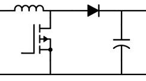

# Model Devlopment of Power Converter

## Power Schema

12V ---> 48V ---> 30V Variable Powersupply ---> BLDC Motor Driver

12V ---> 5V ---> uC

We will be modeling the main power system to ensure it can meet the needs of the specifications and we can determine the necessary component values to create the schematic. Below shows the basic boost converter layout. 

The boost converter system has an input voltage and an output voltage. We will derive the equations needed to model the system. 

The switch current is not continuous so for our first block this will not be the output. The current across the inductor however will be continuous, but the equations governing it change based on the state of the system. 

The equation governing the first part of the system (the inductor current) is as follows: 

$$
v_L=L\frac{di}{dt}
$$

Where $v_L$ by KVL is the difference between $V_{in}$ and $R_{sense}$ (used to detect over-currents) when the switch is closed. Here is the expression for inductor current when the switch is closed: 

$$
    V_{in}-i_LR_{sense}=L\frac{di_L}{dt}
$$
$$
    \frac{di}{dt}=\frac{1}{L}(V_{in}-i_LR_{sense})
$$

When the switch opens, the current expression changes. We will begin by approximating with an ideal diode. Since the output of our system is in terms of current, we will express the output voltage in terms of the total current entering the output capacitor. 

$$
i_C=C\frac{dV_{out}}{dt}
$$

The sign convention we will use is that positive inductor current is current flowing into the positive terminal of the capacitor. Suggesting that positive current into the capacitor will increase the voltage. Below is the closed-switch expression 

---
## The Control System (In Progress)

The transfer function of the output voltage in relation to input is given by:

$$\frac{V_{out}}{V_{in}}=\frac{1}{1-D}$$

This means we have a non-linear relationship between the input voltage and the output voltage. This relationship is non-linear and could introduce harmonics in our tranfer function, so we need a control loop that is able to maintain stabiliy of the output voltage. 
