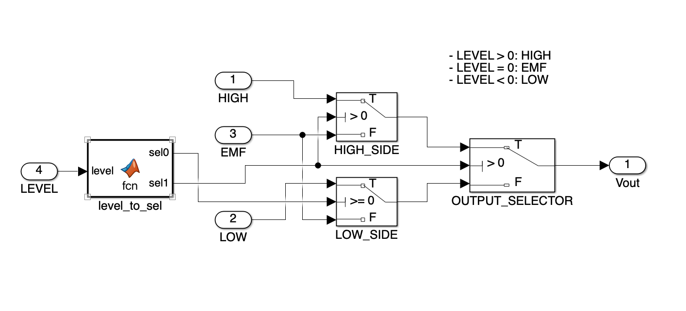
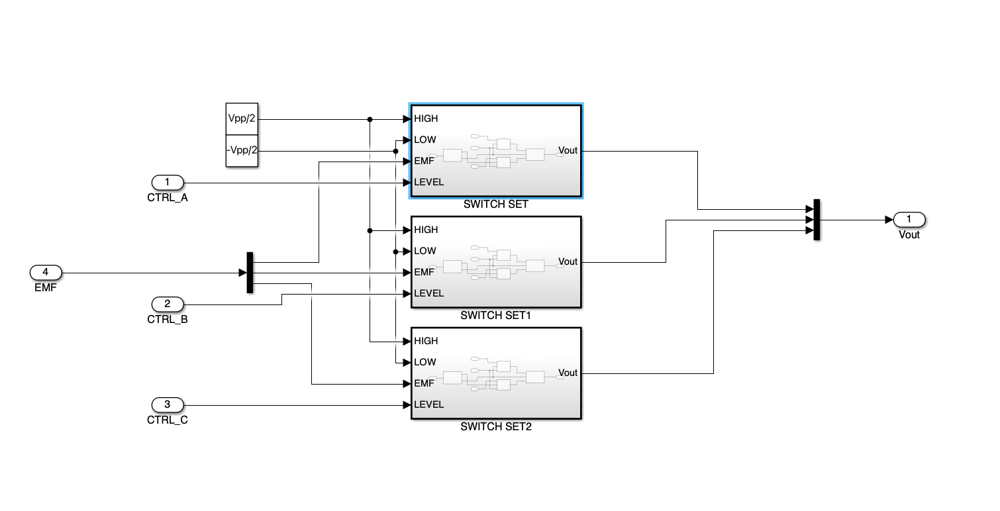
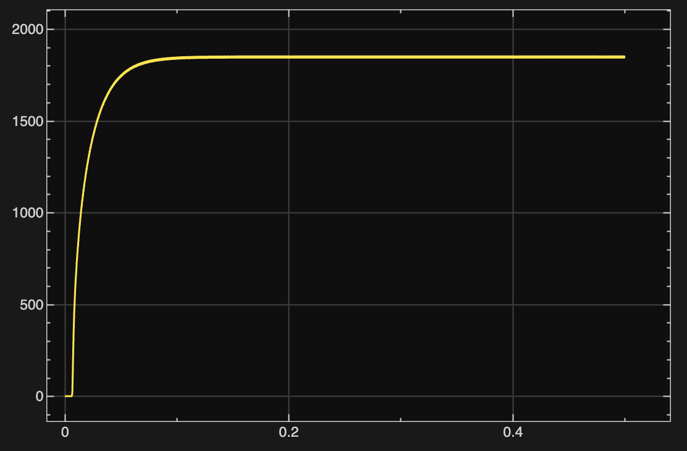

# Controller Development

## Basic Simulink Driver For Model

To evaluate the motor model we need to supply voltages to the motor at the proper timing. To do this, we run the motor at full throttle by timing the voltage so that the correct phases are energized when the rotor is in a specific sector. Because the time constant for the winding resistance and inductance is small, we can obtain a fairly accurate model by letitng the phase of the voltage be near the phase of the current. 

The driver was implemented using vanilla simulink (trial version only supports this). The mosfets were simulated using simulink switches. When the switches were opened, the voltage was set to emf (no current would be flowing through winding resistance). When on the switch was connected to either the high or low constants of the DC input voltage. The figure below shows the wiring and logic. 

Ultimately, the purpose of the segment shown above is to have the state of the "MOSFETS" be controlled by one signal simplifying upstream logic. Zooming out a level we have the setup shown below. 

This diagram shows the switch connections and the phase control signals that specify the state of the phase drivers. Going another level up we have the entire loop showing how the switch states get set based on the angle of the rotor. The angle of the rotor determines the sector which determines which voltages are excited to produce the necessary torque to drive the motor. 

#### Output Speed with 24Vpp Driver

## Simulink Controller in Practice

In practice, this controller will not have a position measurement (unless we introduce a tacheometer). The method we will use to gain positional feedback is zero-crossing detection and blind-startup. 

### Blind Startup

In blind startup, we need to consider the current draw of the motor. To control this, we will ramp up the voltage. 