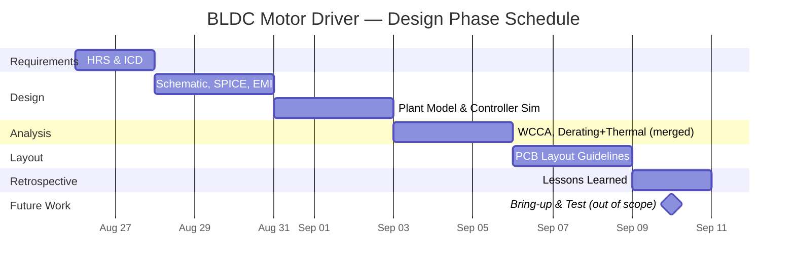

# BLDC Motor Driver (VFMD) — Project Documentation

**Purpose:** Solo portfolio project to build and demonstrate hands-on ownership of a full power-electronics design lifecycle, targeting the skill set for aerospace power electronics roles (motor drives, EMI filtering, worst-case analysis, formal V&V documentation).

The driver will be deigned to drive UAV motors used in drone applications. This will provide a practical circuit where realistic specifications can be used to practice desiging under real-world constraints. 

Using claude, I obtained a rough estimate for drone weight range to save research time, as the scope of this project is mostly determining electrical requirements given the application. 

**Status:** Defining Requirements
**Started:** — Aug 26, 2026
**Target completion:** — Sept 10, 2026

## Project Summary
Design, build, and verify a sensored BLDC motor driver (six-step commutation), 24–48V DC input, with input EMI filtering, current sensing/protection, and closed-loop speed control.

## Project Deliverables 
- [ ] Simulation Files: motor+propeller plant model and closed-loop controller (state-space, Simulink)
- [ ] Circuit Test Report
- [ ] Full Schematic of motor controller
- [ ] BOM
- [ ] Total cost of motor controller. 

## Tasklist 

### Drone Requirement Definitions
- [x] Get Specific Drone Parameters
    - Obtain Motor P/N
    - Obtain Battery Cell Characteristics

- [x] Calculate Peak Power Drone Ratings
- [ ] Estimate Dynamic Characteristics Of Drone

### Electromechanical Plant Modeling (Motor + Propeller Load)
- [ ] Derive state-space model: armature RL + back-EMF (from Kv/Kt) + rotor inertia + aero load torque (τ_load = k·ω², from prop Ct/Cq at 10,000 ft density)
- [ ] Linearize around the 500g operating point; verify stability margins (Bode / root locus)
- [ ] Extract I-V operating point from the plant model for power converter specs

### Closed-Loop Controller Simulation (Simulink)
- [ ] Design cascaded current (inner) + speed (outer) PI loops
- [ ] Simulate closed-loop response to a load-torque disturbance step (e.g., altitude/density change)
- [ ] Verify speed regulation and current-limit engagement against REQ-002 / REQ-003; produce transient response plots

### Circuit Construction and Simulation 
- [ ] Find components on digikey
- [ ] Simulate in LTSPICE
- [ ] Calculate Circuit Performance Under Varying Load 

### EMI Filter Design
- [ ] Estimate EMI components
- [ ] Design EMI filters 

## Project Schedule

Scope for the 2-week window is design-only: Requirements → Design → Analysis → Layout, closed out with a retrospective. Bring-up and Test require a physical prototype (breadboard/eval-board or fabricated PCB) and are intentionally scoped as future work rather than padded into an unrealistic two-week hardware turnaround.

## Document Index

| Phase | Document | Status |
|---|---|---|
| 1. Requirements | [Requirements Spec (HRS)](01_Requirements/Requirements_Spec.md) | Not started |
| 1. Requirements | [Interface Control Document (ICD)](01_Requirements/Interface_Control_Document.md) | Not started |
| 2. Design | [Schematic Design Notes](02_Design/Schematic_Design_Notes.md) | Not started |
| 2. Design | [SPICE Analysis](02_Design/SPICE_Analysis.md) | Not started |
| 2. Design | [Control Algorithm / Simulink Notes](02_Design/Control_Algorithm_Notes.md) | Not started |
| 2. Design | [Magnetics & EMI Filter Design](02_Design/Magnetics_EMI_Filter_Design.md) | Not started |
| 3. Analysis | [Worst-Case Circuit Analysis (WCCA)](03_Analysis/Worst_Case_Circuit_Analysis.md) | Not started |
| 3. Analysis | [Component Derating](03_Analysis/Component_Derating.md) | Not started |
| 3. Analysis | [Thermal Analysis](03_Analysis/Thermal_Analysis.md) | Not started |
| 4. Layout | [PCB Layout Guidelines](04_Layout/PCB_Layout_Guidelines.md) | Not started |
| 5. Bring-up | [Bring-up Log](05_Bringup/Bringup_Log.md) | Not started |
| 6. Test | [Design Verification Test Procedure (DVTP)](06_Test/DVTP.md) | Not started |
| 6. Test | [Design Verification Test Report (DVTR)](06_Test/DVTR.md) | Not started |
| 7. Retrospective | [Lessons Learned](07_Retrospective/Lessons_Learned.md) | Not started |

## Research and Sources

| Question Answered | Link(s) | Additional Notes |
|---|---|---|
| Fundamentals of Drone Drivers | [Drone Driver Design Resource](https://www.edn.com/design-fundamentals-for-drone-motor-controller/) | Provides and overview of drone controller design |
| Drone Calculations | [Flight Characteristics](https://news.quadpartpicker.com/how-to-estimate-and-calculate-drone-flight-characteristics/) | Formulas for dynamic characteristics system needs to handle. |
| Drone Part Selection | [Guide Part Selection](https://news.quadpartpicker.com/how-to-pick-motors-propellers-escs-and-lipo-batteries-for-your-fpv-quad/) [T-Motor Selection Guide](https://shop.tmotor.com/blog/drone-motor-size-chart?srsltid=AfmBOorPpQ9EeZD_yIzcbyiBnF-B2rKL4ujpZodHljFC1filVFW6Nbga) | Tutorial showing how to use table from motor spec |  

## Problems Encountered and Solutions
