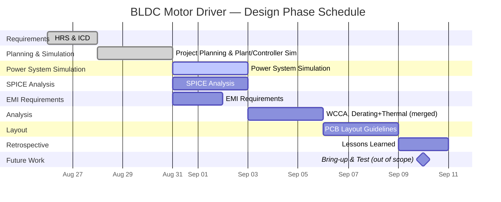

# BLDC Motor Driver (VFMD) — Project Documentation

**Purpose:** Solo portfolio project to build and demonstrate hands-on ownership of a full power-electronics design lifecycle, targeting the skill set for aerospace power electronics roles (motor drives, EMI filtering, worst-case analysis, formal V&V documentation).

The driver will be deigned to drive UAV motors used in drone applications. This will provide a practical circuit where realistic specifications can be used to practice desiging under real-world constraints. 

Using claude, I obtained a rough estimate for drone weight range to save research time, as the scope of this project is mostly determining electrical requirements given the application. 

**Status:** Defining Requirements
**Started:** — Aug 26, 2026
**Target completion:** — Sept 10, 2026

## Project Summary
Design, build, and verify a sensored BLDC motor driver (six-step commutation), 24–48V DC input, with input EMI filtering, current sensing/protection, and closed-loop speed control.

## Project Deliverables 
- [x] Specifications 
- [x] Simulation Files: motor+propeller plant model and closed-loop controller in Simulink
- [ ] Simulation of Power System in Simulink
- [ ] Full Schematic of motor controller using real components
- [ ] BOM
- [ ] Total cost of motor controller. 

## Tasklist 

### Drone Requirement Definitions
- [x] Get Specific Drone Parameters
    - Obtain Motor P/N
    - Obtain Battery Cell Characteristics

- [x] Calculate Peak Power Drone Ratings
- [x] Estimate Dynamic Characteristics Of Drone

### Electromechanical Plant Modeling (Motor + Propeller Load)
- [x] Derive state-space model: armature RL + back-EMF (from Kv/Kt) + rotor inertia + aero load torque (τ_load = k·ω², from prop Ct/Cq at 10,000 ft density)
- [ ] Linearize around the 500g operating point; verify stability margins (Bode / root locus)
- [x] Extract I-V operating point from the plant model for power converter specs

### Closed-Loop Controller Simulation (Simulink)
- [ ] Design cascaded current (inner) + speed (outer) PI loops
- [ ] Simulate closed-loop response to a load-torque disturbance step (e.g., altitude/density change)
- [ ] Verify speed regulation and current-limit engagement against REQ-002 / REQ-003; produce transient response plots

### Circuit Construction and Simulation 
- [ ] Find components on digikey
- [ ] Simulate in LTSPICE
- [ ] Calculate Circuit Performance Under Varying Load 

### EMI Filter Design
- [ ] Estimate EMI components
- [ ] Design EMI filters 

## Project Schedule

Scope for the 2-week window is design-only: Requirements → Design → Analysis → Layout, closed out with a retrospective. Bring-up and Test require a physical prototype (breadboard/eval-board or fabricated PCB) and are intentionally scoped as future work rather than padded into an unrealistic two-week hardware turnaround.

## Document Index

| Phase | Document | Status |
|---|---|---|
| 1. Requirements | [Requirements Spec (HRS)](01_Requirements/Requirements_Spec.md) | In Progress |
| 1. Requirements | [Calculations and Analysis](01_Requirements/Calculations_and_Analysis.md) | In Progress |
| 2. Design — Simulink (Motor Model) | [Results & Model Summary](02_Design/Simulink_Modeling/BLDC_Motor_Model/01_Results_and_Model_Summary.md) | In Progress |
| 2. Design — Simulink (Motor Model) | [Model Derivations](02_Design/Simulink_Modeling/BLDC_Motor_Model/02_Model_Derivations.md) | In Progress |
| 2. Design — Simulink (Motor Model) | [Model Development](02_Design/Simulink_Modeling/BLDC_Motor_Model/03_Model_Development.md) | In Progress |
| 2. Design — Simulink (Power System) | [Power System Model Development](02_Design/Simulink_Modeling/Power_System_Model/01_Model_Development.md) | In Progress |
| 2. Design — SPICE & Schematic | [Schematic Design Notes](02_Design/Spice_Analysis_and_Schematic/Schematic_Design_Notes.md) | Not started |
| 2. Design — SPICE & Schematic | [SPICE Analysis](02_Design/Spice_Analysis_and_Schematic/SPICE_Analysis.md) | Not started |
| 2. Design — SPICE & Schematic | [Control Algorithm Notes](02_Design/Spice_Analysis_and_Schematic/Control_Algorithm_Notes.md) | In Progress |
| 3. Block Diagrams | [Block Diagram Revisions](03_Block_Diagrams/) | Reference images (R1–R3) |
| Chassis Design Guide | [Boston University's Guide](https://sites.bu.edu/uav/first-build/step1/) | External reference |

Directories for Analysis, Layout, Bring-up, Test, and Retrospective phases have not been created yet — see [Project Schedule](#project-schedule) above.

## Research and Sources

| Question Answered | Link(s) | Additional Notes |
|---|---|---|
| Fundamentals of Drone Drivers | [Drone Driver Design Resource](https://www.edn.com/design-fundamentals-for-drone-motor-controller/) | Provides and overview of drone controller design |
| Drone Calculations | [Flight Characteristics](https://news.quadpartpicker.com/how-to-estimate-and-calculate-drone-flight-characteristics/) | Formulas for dynamic characteristics system needs to handle. |
| Drone Part Selection | [Guide Part Selection](https://news.quadpartpicker.com/how-to-pick-motors-propellers-escs-and-lipo-batteries-for-your-fpv-quad/) [T-Motor Selection Guide](https://shop.tmotor.com/blog/drone-motor-size-chart?srsltid=AfmBOorPpQ9EeZD_yIzcbyiBnF-B2rKL4ujpZodHljFC1filVFW6Nbga) | Tutorial showing how to use table from motor spec |  
| EMI for Aircraft Applications | [Controlling the EMI effects of aircraft avionics](https://www.aerospacemanufacturinganddesign.com/article/amd0415-aircraft-avionics-emi-effects/) | Guide for determining EMI constraints in airborn applications

## Problems Encountered and Solutions

#### Component Selection uses Generous Parameters but does not Account For Cost.

Solution: Take an iterative design approach during the planning phase. 

- Constraints the iteration to the design phase so major changes to requirements are not necessary in later design phases. 
- Cost trimming can happen early
- Gives numerical values early giving a starting point on how the numbers relate. 

#### Misread a Data Table and Wasted Time doing Extra Calculations 

Solution: Collect all data before doing calculations, use AI to provide rough estimates. Once all data is together then manually calculate parameters. 

#### Simulation and Planning Should be Merged into one-phase, since accurate models for load are needed to define driver requirements. 

- TODO: Find process to iterate through gaining estimates, simulating model based on estimates. 
- Write an explicit list of all parameters needed to fully characterize the driver-board constraints. 

#### Build entire simulink model without testing throughout the process. 
- Ultimately this problem was due to poor planning. 
- The model didn't work and to fix this I'm taking a systematic approach to developming the model rather than simply building everything from scratch. 
- We can anticipate problems much easier when we plan. 

## Project Takeaways

- Use tools available to save time and resources. 
- Search components for application before trying to find specifications. This provides rough estimates. 
